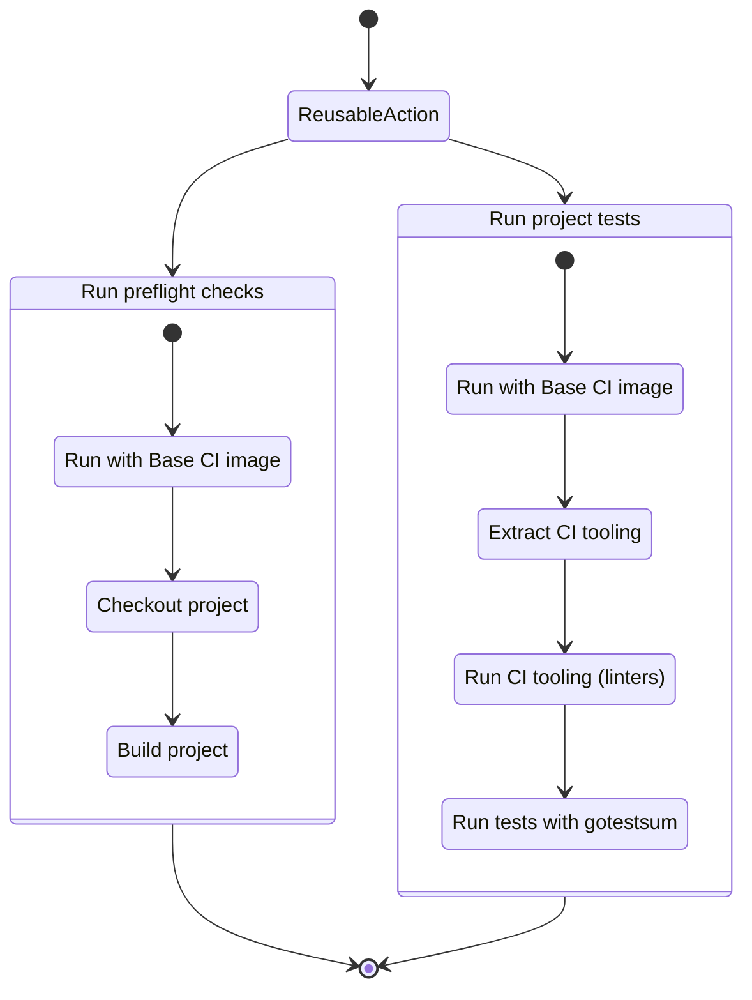

# Reusable CI pipelines

The repository sets up reusable CI pipelines which are organized by the
product being tested. In order to use the pipelines, the following github
action needs to be added to the source repository.

```yaml
name: Tests latest

on:
  pull_request:
    branches:
      - master

jobs:
  gateway-ci:
    uses: TykTechnologies/tyk-github-actions/.github/workflows/gateway-latest.yml@main
    secrets:
      ORG_GH_TOKEN: ${{ secrets.ORG_GH_TOKEN }}
```

The valid workflow files are:

- `gateway-5.0.yml` for gateway, release-5-lts (LTS release)
- `gateway-5.2.yml` for gateway, release 5.2/master (current release)
- `gateway-latest.yml` for gateway, master (next CI release)
- `dashboard-5.0.yml` for dashboard, release-5-lts (LTS release)
- `dashboard-5.2.yml` for dashboard, release 5.2/master (current release)
- `dashboard-latest.yml` for dashboard, master (next CI release)

Referencing the workflow in this way ensures that the latest version for
the release target is in use. This is all that is needed on the consumer
side. Even with branching, the CI for a single release would be
maintained across all the release branches that now just reference it via
the reusable GitHub action.

This is a state diagram for the current actions structure:



# Structure

There are three main points to the repository:

- GitHub actions under `.github/`
- Docker images under `docker/`
- Tests under `tests/`.

The CI actions are set up in a composable way. Not only are the source
repositories referencing them with a reusable action, the action then
again uses reusable workflows and composite actions internally.

The actions rely on using a docker CI base image, and a CI image bundling
various tools to run in CI workflows to ensure code quality. From end to
end, the individual components of a CI pipeline are being tightly scoped
according to their responsibility, optimizing for that.

## Reusable github actions

The reusable github actions are mainly oriented around a "preflight" and
a "test" workflow. If you're thinking about a go project in simplistic
terms, this achieves the following:

- preflight: does the code compile (e.g. do we have a deliverable binary)
- test: doest the change being made pass the tests we have (go test)

There are some problems that the workflows aim to solve. For example, for
the test action, we're using `gotestsum` to run and retry the tests if
they fail. We have flaky tests that are not deterministic, that are
time-dependant, and are likely to fail. Using modern tooling with options
to rerun those tests allows for a more stable pipeline.

## Composite actions

The repository declares several composite actions, namely:

- `checkout` - check out the last state of the PR (fetch-depth=1),
- `checkout-pr` - check out the full history of the PR (number of commits made),
- `gotestsum` - run gotestsum with some configurable parameters.

These actions are internal in nature and are used from the respective
pre-flight or tests workflows. They automatically enable `lfs`, git
`submodules`, and solve some problems like checking out from private
repositories.

## Docker images

The repository builds several docker images as documented below. These
images serve to fulfill two purposes:

- CI tooling delivery without wasting CPU time on `go install`.
- Base integration environment with OS and Go version needed.

The images are meant to be used from docker actions, and can also be
built and used for local testing. More information can be found under the
`docker/`, `tests/` path, and assorted README.md and Taskfile.yml files
within.

## Internal github actions

This repository has 3 internal github actions. The actions handle the
following responsibilities:

- `ci-lint.yml` - runs `task lint` on the repository,
- `ci-docker-tools.yml` - builds a docker image with CI tooling,
- `ci-docker-base.yml` - builds several docker images with a base CI environment,

## Lint

In order to ensure some standard of quality, a lint action is being run
that checks for syntax issues, yaml issues and validates github actions
in the repository. It's not complete or fully accurate by any measure,
but it enforces conventions for the work being added in PRs.

It runs the following tooling:

- [rhysd/actionlint](https://github.com/rhysd/actionlint)
- shellcheck
- yamllint

It's generally incomplete, but extensions are welcome.

## CI tools

We build a docker image from the CI pipeline in this repository that
builds and installs all the CI tooling needed for the test pipelines.

Providing the docker image avoids continous compilation of the tools from
using `go install` or `go get`, decreasing resource usage on GitHub
actions.

All the tools are built using a recent go version and `CGO_ENABLED=0`,
enabling reuse for old releases. It's still possible to version the
tooling against releases either inside the image, or by creating new
versions of the docker image in the future.

The images built are:

- `tykio/ci-tools:latest`.

The image is rebuilt weekly.

To use the CI tools from any github pipeline:

```yaml
- name: 'Extract tykio/ci-tools:${{ matrix.tag }}'
  uses: shrink/actions-docker-extract@v3
  with:
    image: tykio/ci-tools:${{ matrix.tag }}
    path: /usr/local/bin/.
    destination: /usr/local/bin

- run: gotestsum --version
```

The action
[shrink/actions-docker-extract](https://github.com/shrink/actions-docker-extract)
is used to download and extract the CI tools binaries into your CI
workflow. The set of tools being provided can be adjusted in
[docker/tools/latest/Dockerfile](https://github.com/TykTechnologies/tyk-github-actions/blob/main/docker/tools/latest/Dockerfile).

A local Taskfile is available in `docker/tools/` that allows you to build
the tools image locally. Changes are tested in PRs.

## CI base images

We build docker images from the CI pipelines in this repository that
provide a base CI image. This includes control over the operating system,
go version, python version and required dependencies for the test
pipelines.

The repository provides several CI base images. The base image controls
the operating system being used, the go version being used, and by
extension which python version is being delivered from the base OS.

The images built are:

- `tykio/ci-base:latest` - Debian Bookworm, Go 1.21, Python 3.11
- `tykio/ci-base:5.2` - Debian Bullseye, Go 1.19, Python 3.9
- `tykio/ci-base:5.0` - Debian Bullseye, Go 1.16, Python 3.9

The images are rebuilt weekly.

A local Taskfile is available in `docker/base/` that allows you to build
the base images locally. Changes are built in PRs, but only pushed when
the PR gets merged to the main branch.

# Creating a new pipeline

In order to create a new CI pipeline, it's expected that the current
`latest` pipelines and docker images will become the future 5.3 release
(+1 minor version). When that happens, all we need is to create a local
copy of those workflows.

This must happen on significant possibly breaking changes:

- The upgrade of Go versions (1.16, 1.19, 1.21) and tooling
- A change of the base operating system (Debian release, Alpine, etc.)
- Architectural requirements (arm64 test pipelines)

Depending on how the operating system transitions it's packages,
individual release target base CI images need to pin an expected version
of a package. For example, the OS may provide packages for both python3.9
and python3.11; while we may work with both versions, pinning a
dependency ensures our tests will run against a known version, and will
not break unnecessarily if the OS decides to update their default
installation from 3.9 to 3.11.

Pinning dependencies is also important for CI tooling. Keeping the
tooling up to date requires updating the configuration, invocation, and
may be something that we only want to do against the latest release.
Pinning tooling versions ensures that the config and the release CI for
an older release will continue to work in the future.
